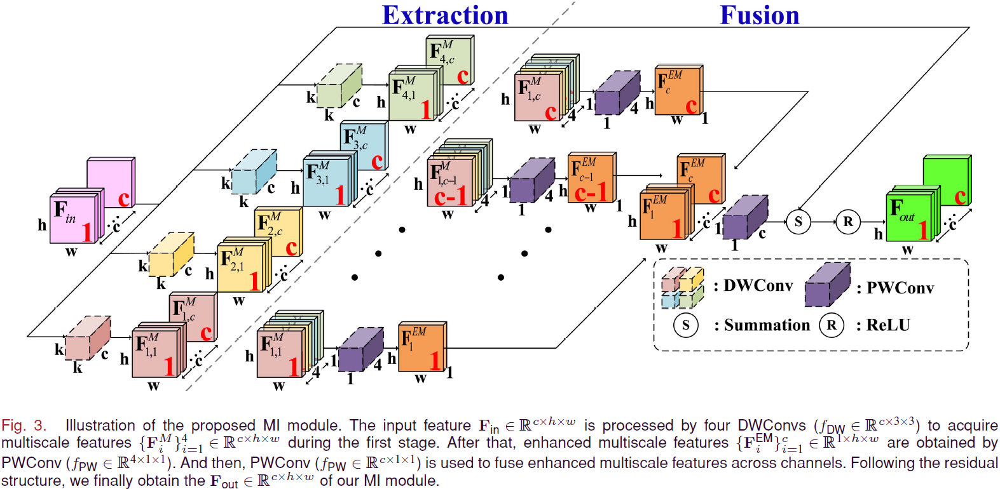
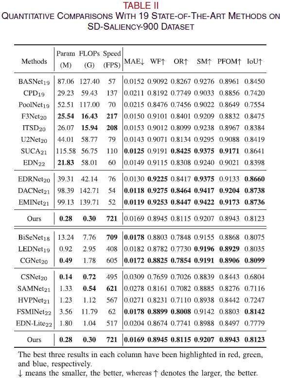
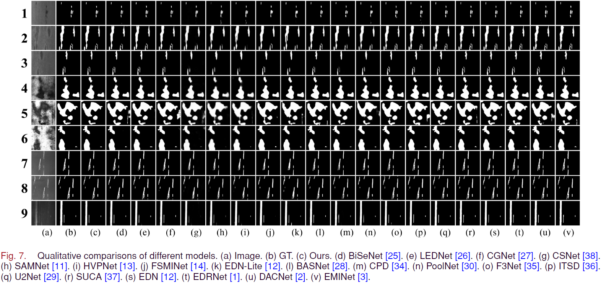

<div align="center">

# MINet: Multiscale Interactive Network for Real-Time Salient Object Detection of Strip Steel Surface Defects

[](https://ieeexplore.ieee.org/)
[](LICENSE)
[](https://www.python.org/)
[](https://pytorch.org/)

</div>

---

## 目录

- [新闻](#新闻)
- [概述](#概述)
- [网络架构](#网络架构)
- [实验结果](#实验结果)
- [环境配置](#环境配置)
- [快速开始](#快速开始)
- [项目结构](#项目结构)
- [常见问题](#常见问题)
- [引用](#引用)
- [许可证](#许可证)

---

## 新闻

- [2024] 论文被 **IEEE Transactions on Industrial Informatics (TII)** 接收。
- [2024] 我们正式开源了代码、训练好的模型权重和预测结果。

---

## 概述

MINet 是一个专为**带钢表面缺陷显著性目标检测**设计的实时轻量网络。

核心创新为 **MI Module（多尺度交互模块）**，通过 4 路不同空洞率（d=1, 2, 4, 8）的深度可分离卷积并行提取多尺度特征，再通过通道重组（Channel Shuffle）实现跨尺度信息交互，最后以残差连接融合输出。整个网络使用深度可分离卷积构建，无需预训练骨干网络，实现了检测精度与推理速度的平衡。

### 主要特性

- **实时性能**：全深度可分离卷积 + MI Module 构建的轻量网络，在 368×368 输入下可达 ~300 FPS
- **多尺度交互模块（MI Module）**：通过并行空洞卷积（d=1,2,4,8）+ 通道重组实现跨尺度信息融合
- **深度监督**：5 个不同分辨率的侧输出参与训练损失计算，加速收敛并提升精度
- **完全自底向上**：无需 ImageNet 预训练权重，从头开始训练即可达到优异性能

---

## 网络架构

### MI Module（多尺度交互模块）

MI Module 是 MINet 的核心创新模块，流程如下：

1. **多尺度特征提取**：使用 4 路不同空洞率（d=1, 2, 4, 8）的逐通道卷积（Depthwise Conv）并行提取特征
2. **跨尺度通道重组（Shuffle）**：将 4 种尺度的特征按通道维度切分并重组，使每个输出通道同时包含 4 种尺度的信息
3. **逐通道融合**：每个通道使用独立的 1×1 卷积融合 4 种尺度信息
4. **残差连接**：融合结果与原始输入相加后通过 ReLU 输出



### 整体网络结构

MINet 采用 U-Net 风格的编码器-解码器结构，共 5 个阶段：

| 阶段 | 编码器 | 输出尺寸 | MI Module 数量 | 解码器 |
|:----:|:------:|:--------:|:--------------:|:------:|
| 1 | Conv 3×3, stride 2 | 16×184×184 | 0 | DSConv → DSConv |
| 2 | DSConv stride 2 + 3×MI | 32×92×92 | 3 | DSConv → DSConv |
| 3 | DSConv stride 2 + 4×MI | 64×46×46 | 4 | DSConv → DSConv |
| 4 | DSConv stride 2 + 6×MI | 96×23×23 | 6 | DSConv → DSConv |
| 5 | DSConv stride 2 + 3×MI | 128×12×12 | 3 | DSConv → DSConv |

解码器通过双线性插值逐步上采样，并通过元素相加与编码器对应层的跳跃连接融合。5 个解码阶段各输出一张显著性图，训练时全部参与损失计算（深度监督），测试时取最精细的输出（out1）作为最终结果。

---

## 实验结果

### 定量对比



### 定性对比



### 推理速度

| 方法 | 输入尺寸 | FPS |
|:----:|:--------:|:---:|
| MINet | 368×368 | ~300 |

运行速度测试：
```bash
python FPS.py
```

---

## 环境配置

### 环境要求

- Python 3.7 或更高版本
- PyTorch 1.4.0 或更高版本
- CUDA（推荐，训练需要）

### 安装步骤

**1. 克隆仓库**
```bash
git clone https://github.com/Kunye-Shen/MINet.git
cd MINet
```

**2. 创建虚拟环境（推荐）**
```bash
conda create -n minet python=3.9 -y
conda activate minet
```

**3. 安装依赖**
```bash
pip install -r requirements.txt
```

如需为特定 CUDA 版本安装 PyTorch，请先参考 [PyTorch 官方安装指南](https://pytorch.org/get-started/locally/) 安装 PyTorch 和 torchvision，再安装其余依赖。

**4. 验证安装**
```bash
python -c "from model import MINet; import torch; print('OK')"
```

---

## 快速开始

### 下载资源

我们提供了训练好的模型权重和预测结果：

| 资源 | 链接 |
|:----:|:----:|
| 预测结果图 | [Google Drive](https://drive.google.com/drive/folders/1cj_Gd8EDIPvP4SpCdNWhS4G-fRMxm7VC?usp=drive_link) |
| 预测结果图 | [百度网盘](https://pan.baidu.com/s/1eBZX_1Nf_sWYVz2opp4f0A) (提取码: **rokb**) |

将下载的权重文件放入 `model_save/` 目录。

### 数据集准备

数据集按以下结构组织：

```
Dataset/
└── SD-saliency-900/
    ├── Img_train/    # 输入图像（.bmp 格式）
    └── GT_train/     # 标注图像（.png 格式，白色=缺陷，黑色=背景）
```

图像文件与标注文件需一一对应，例如 `Img_train/In_1.bmp` 对应 `GT_train/In_1.png`。

所有数据路径和超参数均在 `config.py` 中集中配置，可根据需要修改。

### 运行推理

```bash
python test.py
```

脚本加载 `model_save/MINet_best.pth`，对数据集进行推理，在 `results/` 目录下生成左右对比图（左为原图，右为预测结果）。

### 从头训练

```bash
python train.py
```

训练参数及默认值：

| 参数 | 默认值 | 说明 |
|:----:|:------:|:----:|
| 训练轮数 | 80 | 完整训练轮次 |
| 批次大小 | 32 | 每批次样本数 |
| 初始学习率 | 0.004 | Adam 优化器 |
| 学习率衰减 | 每 30 轮 ×0.5 | StepLR 调度器 |
| 损失函数 | BCE + SSIM | 混合损失，5 个侧输出求和 |

训练中的模型保存在 `model_save/` 目录：

- `MINet_best.pth` — 训练过程中损失最低的模型
- `MINet.pth` — 最终模型（80 轮后）
- `epoch_*.pth` — 每轮存档
- `epoch_*_iter_*.pth` — 每 1000 次迭代的检查点

### 修改配置

所有实验配置均在 `config.py` 中集中管理，包括：

- **数据集路径**：`dataset` 字典中修改 `image_dir` 和 `label_dir`
- **训练超参数**：`train` 字典中修改学习率、批次大小等
- **数据增强**：`transform` 字典中修改缩放尺寸、裁剪尺寸等
- **模型保存路径**：`model` 字典中修改 `model_save_dir` 和 `checkpoint`

### 测速

```bash
python FPS.py
```

以 300 张 368×368 随机图像为一组，运行 100 轮（跳过前 20 轮预热），计算平均 FPS。

---

## 项目结构

```
MINet/
├── LICENSE                   # MIT 许可证
├── CITATION.cff              # 引用元数据
├── README.md                 # 本文件（中文）
├── README-EN.md              # 英文版 README
├── requirements.txt          # Python 依赖
├── setup.py                  # 包安装配置
├── config.py                 # 实验配置（路径、超参数、模型参数）
├── train.py                  # 训练脚本
├── test.py                   # 推理/可视化脚本
├── FPS.py                    # 速度测试脚本
├── data_loader.py            # 数据集类和预处理变换
├── model/
│   ├── __init__.py           # 包入口，导出 MINet
│   ├── basic.py              # 基础模块（Conv、DSConv、MI_Module、ConvOut）
│   └── MINet.py              # 完整网络定义
├── pytorch_ssim/
│   └── __init__.py           # SSIM 损失函数实现
├── figures/                  # 论文插图
├── model_save/               # 模型权重保存目录（训练生成）
├── results/                  # 预测结果输出目录（测试生成）
└── Dataset/                  # 数据集（用户自行准备）
    └── SD-saliency-900/
        ├── Img_train/        # 输入图像
        └── GT_train/         # 标注图像
```

---

## 常见问题

**Q1: ModuleNotFoundError: No module named 'xxx'**

当前环境未安装对应包，执行 `pip install xxx` 安装。

**Q2: FileNotFoundError 找不到数据集**

检查 `config.py` 中 `dataset` 配置的路径是否正确，确认目录结构完整，确保图片与标注文件名一一对应。

**Q3: CUDA out of memory**

显存不足。减小 `config.py` 中 `train.batch_size`（如 32 → 8 或 16）。

**Q4: Python 版本兼容性**

- Python 3.12 与 `sacred` 等包存在兼容性问题，推荐使用 Python 3.9–3.11
- 如遇 `setuptools` 相关错误，尝试 `pip install 'setuptools<81'`

**Q5: 加载模型时 state_dict 不匹配**

如果用不同配置或不同版本的代码训练，加载时可能遇到 key 不匹配。可设置 `strict=False`：
```python
net.load_state_dict(torch.load('model.pth'), strict=False)
```

**Q6: 如何确认正在使用 GPU？**

```bash
python -c "import torch; print(torch.cuda.is_available())"
```
输出 `True` 表示使用 GPU，`False` 表示使用 CPU。

---

## 引用

如果您在研究中使用了 MINet，请引用我们的论文：

```bibtex
@article{shen2024minet,
  title={MINet: Multiscale Interactive Network for Real-Time Salient Object Detection of Strip Steel Surface Defects},
  author={Shen, Kunye and Zhou, Xiaofei and Liu, Zhi},
  journal={IEEE Transactions on Industrial Informatics},
  year={2024}
}
```

---

## 许可证

本项目采用 [MIT 许可证](LICENSE)。

---

## 联系

- [沈昆烨 (Kunye Shen)](https://scholar.google.com.hk/citations?user=q6_PkywAAAAJ&hl=zh-CN)
- [周晓飞 (Xiaofei Zhou)](https://scholar.google.com.hk/citations?user=2PUAFW8AAAAJ&hl=zh-CN)
- [刘志 (Zhi Liu)](https://scholar.google.com.hk/citations?user=Sd5VB2cAAAAJ&hl=zh-CN)

如有问题，请在 GitHub 上提出 Issue。
